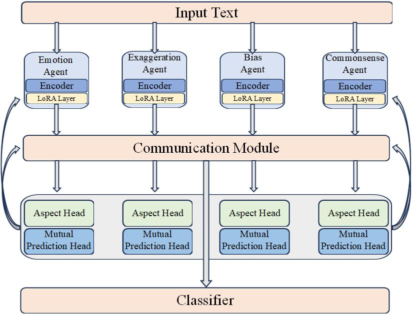
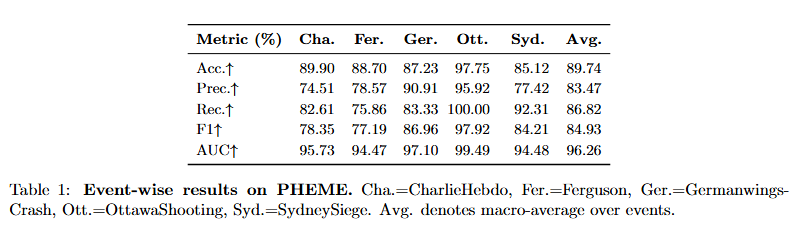
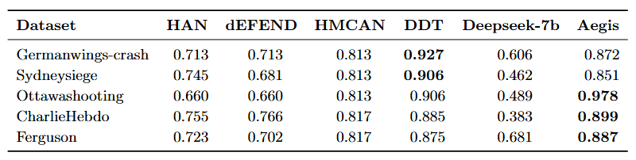

# Multi-Agent Fake-News Detection

A research-oriented implementation of multi-perspective fake-news detection. The system
decomposes a news item into four complementary analytical views—emotion,
exaggeration, bias, and commonsense—and combines their evidence through a staged
decision process.

The repository currently provides a fully runnable, dependency-free reference pipeline
with an offline provider and an OpenAI-compatible DeepSeek provider. It also documents
the broader **Aegis** neural research blueprint developed for collaborative LoRA agents.

## Abstract

Fake-news signals are heterogeneous: emotionally inflammatory language can coexist with
sensational framing, partisan bias, and implausible claims. A single representation may
overfit one signal and generalize poorly across events. This project studies explicit
specialization, in which four agents produce aspect-level evidence before a team-level
decision is made. Ambiguous samples are routed to a verification stage instead of being
forced into a high-confidence first-pass decision.

The broader Aegis design extends this idea with independently adapted encoders, gated
multi-head communication, aspect supervision, mutual prediction, and a fused final
classifier.

## Research architecture



**Figure 1. Aegis research blueprint.** One input is processed by four LoRA-adapted
specialists. Their pooled representations interact through a gated communication module.
Aspect heads preserve specialization, mutual-prediction heads encourage cross-agent
collaboration, and the fused representation is passed to the final classifier.

| Agent | Primary evidence |
| --- | --- |
| Emotion | Inflammatory, fear-inducing, or polarizing language |
| Exaggeration | Absolutist claims, clickbait, and unsupported certainty |
| Bias | One-sided framing, selective evidence, and derogatory positioning |
| Commonsense | Internal inconsistency, implausibility, and conflict with common knowledge |

### Collaborative learning objective

The full research blueprint uses a composite objective:

```text
L = L_final + λ_dim L_dim + λ_cons L_cons + λ_pred L_pred
    + λ_div L_div + λ_gate L_gate
```

- `L_final`: binary fake/real classification loss;
- `L_dim`: aspect-level pseudo-label supervision from a teacher model;
- `L_cons`: consistency between team and final predictions;
- `L_pred`: cross-agent mutual-prediction loss;
- `L_div`: diversity regularization to prevent specialist collapse;
- `L_gate`: sparse communication regularization.

The proposed training schedule first warms up the main and aspect tasks, then gradually
introduces the collaborative losses.

## Runnable release

The code under `src/mafnd` is a lightweight, provider-independent reference
implementation of the multi-agent decision process. Four specialist scores form the
screening probability. Samples in the uncertainty region—and moderately confident fake
predictions—are sent to a second verification layer.

Two providers are included:

- `heuristic`: deterministic, offline, dependency-free, and suitable for smoke tests;
- `deepseek`: an OpenAI-compatible HTTP client using `DEEPSEEK_API_KEY`.

> **Implementation boundary:** Figure 1 documents the full trainable Aegis blueprint.
> The current packaged runtime validates specialist orchestration and conditional
> verification; it does not yet train the LoRA encoders or gated communication module.
> This distinction is intentional so the README does not claim functionality that the
> published package cannot reproduce.

## Preliminary experimental evidence

The following figures were extracted from the project presentation. They are included
to document the current research record, not as CI-reproduced benchmark claims.



**Figure 2. Preliminary event-wise PHEME results.** The presentation reports macro
averages of 89.74% accuracy, 84.93% F1, and 96.26% AUC across five events.



**Figure 3. Preliminary comparison with HAN, dEFEND, HMCAN, DDT, and DeepSeek-7b.**
The extracted table does not identify its metric on the source slide. Treat these values
as provisional until the exact split, metric definition, random seeds, checkpoints, and
evaluation script are released and rerun.

### Reproducibility status

| Component | Status |
| --- | --- |
| Offline screening and verification | Covered by automated tests |
| CSV and single-item inference | Covered by automated tests |
| DeepSeek request path | Implemented; excluded from CI to avoid credentials and cost |
| Full Aegis LoRA training | Research blueprint; not packaged in this release |
| PHEME tables above | Presentation artifact; not reproduced by current CI |

## Installation

```bash
python -m venv .venv
source .venv/bin/activate  # Windows: .venv\Scripts\activate
python -m pip install -e .
```

The runtime has no third-party dependencies. For development:

```bash
python -m pip install -e ".[dev]"
```

## Offline quick start

Analyze one item:

```bash
mafnd --provider heuristic \
  --title "SHOCKING SECRET" \
  --text "An unbelievable miracle has been exposed!"
```

Analyze a CSV file:

```bash
mafnd --provider heuristic \
  --input examples/news.csv \
  --output outputs/predictions.csv
```

The CSV reader accepts `content` or `text`, plus optional `id`, `title`, `subject`,
`date`, and `label` columns. If labels are present, the command reports accuracy.

## DeepSeek mode

Never store an API key in source code or configuration committed to Git. Export it in
your shell and select the provider:

```bash
export DEEPSEEK_API_KEY="..."
mafnd --provider deepseek --input examples/news.csv
```

PowerShell:

```powershell
$env:DEEPSEEK_API_KEY = "..."
mafnd --provider deepseek --input examples/news.csv
```

`DEEPSEEK_BASE_URL` defaults to `https://api.deepseek.com`; `--base-url` and `--model`
can target another OpenAI-compatible chat-completions endpoint.

## Decision rule

Each specialist returns a suspicion score in `[0, 1]`. The screening probability is a
normalized weighted average. Scores at or below `0.30` are initially real, scores at or
above `0.70` are initially fake, and the region in between is uncertain. The second
stage reviews uncertain cases and fake predictions below `0.90`.

```python
from mafnd import HeuristicProvider, MultiAgentDetector, NewsItem

detector = MultiAgentDetector(
    HeuristicProvider(),
    real_threshold=0.30,
    fake_threshold=0.70,
    second_layer_fake_cap=0.90,
)
result = detector.detect(NewsItem(title="Example", content="Article text"))
print(result.to_dict())
```

## Testing

```bash
pytest
```

Tests cover provider-free end-to-end detection, screening/verification behavior, weight
validation, and CSV output.

## Responsible use

This is a research prototype, not an automated fact-checker. Style, emotion, bias, and
plausibility cues are not proof that a claim is false. Human review and evidence from
reliable external sources are required before moderation, publication, or enforcement
decisions. Only synthetic examples are included; verify dataset licenses and privacy
requirements before redistributing real data.

No open-source license has been selected yet. See `RESEARCH_NOTES.md` for provenance,
curation decisions, and the relationship between the runnable release and the broader
Aegis research blueprint.
